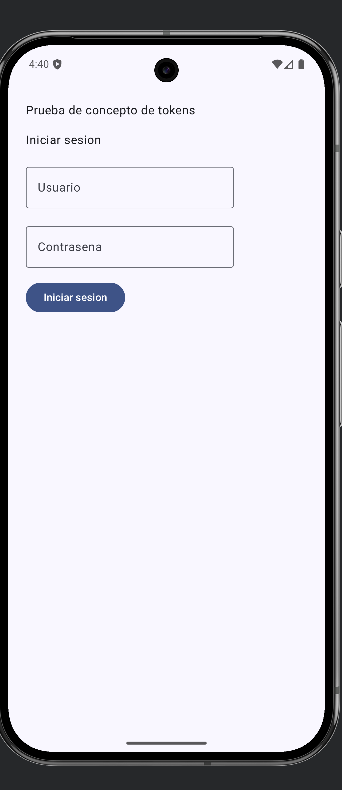
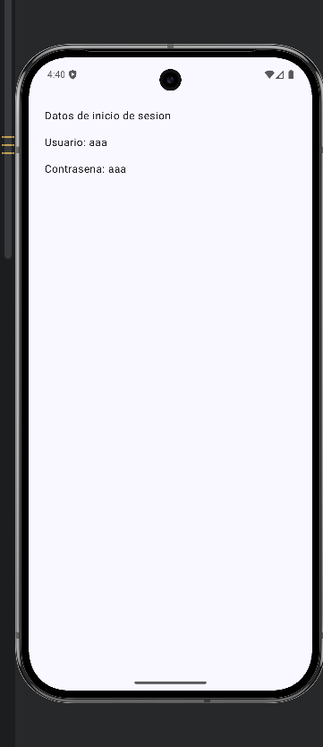
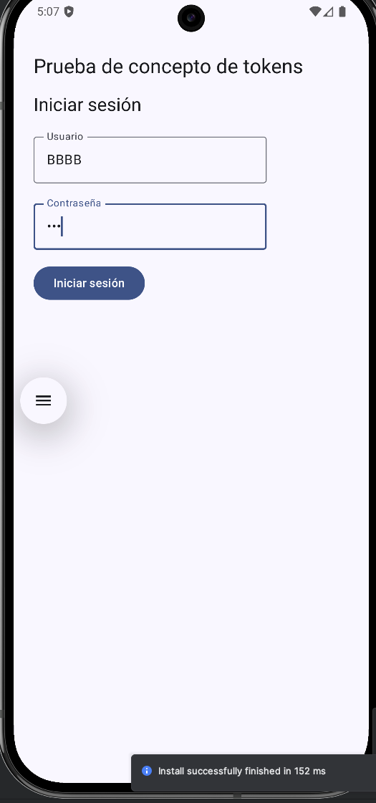
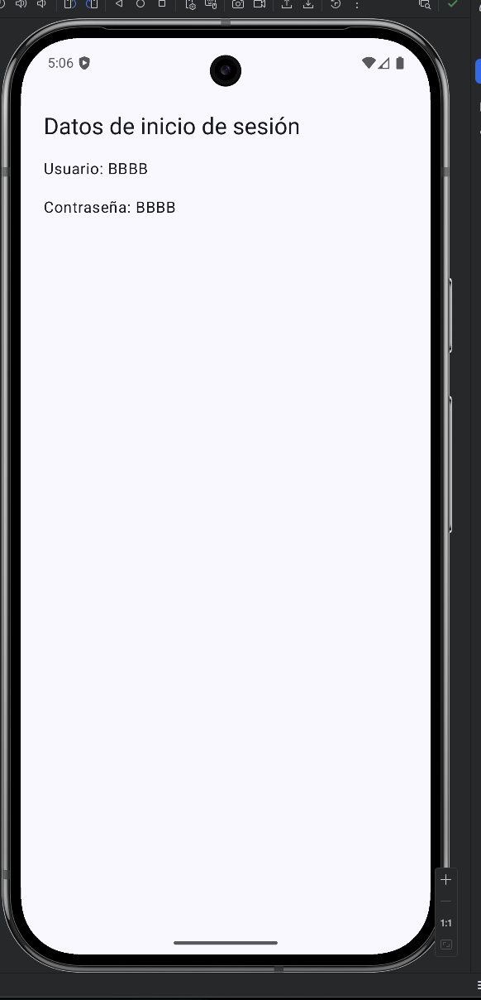
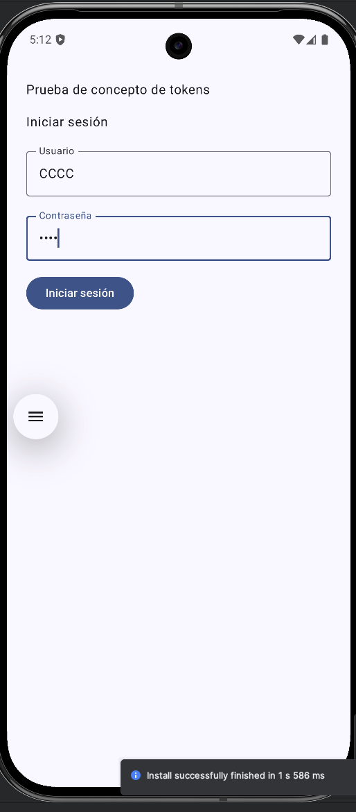
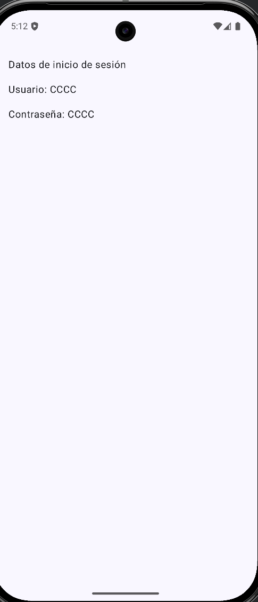

# AI Context Benchmark - Android

A small benchmark to compare three ways of giving context to an AI agent for an Android development task:

1. Requirements from Notion/MCP.
2. A specification pasted directly into the chat.
3. Local SDD/TDD documentation in Markdown.

The implemented feature was always the same: a small app with a login screen, navigation to a result screen, and display of the entered username and password.

## Quick Result

| Scenario | Context source | Estimated usage | Approx. tokens | Clarifications | Takeaway |
| --- | --- | --- | ---: | ---: | --- |
| A | Notion/MCP | Medium | 15000 | 0 | More traceability, more operational cost |
| B | Pasted specification | Low | 4000 | 0 | Cheapest for a small task |
| C | Local SDD/TDD | Low | 8000 | 0 | Middle cost, better future reuse |

## Conclusions

- For a first small implementation, pasting the specification into the chat was the cheapest option in terms of context.
- Notion/MCP provided traceability and a real external source, but loaded more context.
- Local SDD/TDD landed in the middle: more initial cost than pasted text, but it leaves versioned knowledge inside the repository.
- The important metric is not only how much it costs to implement once, but how much it costs to revisit the same work weeks later.

## Downloads
- [Local SDD](docs/ai-context-benchmark/SDD-login-token-poc.md)
- [Local TDD](docs/ai-context-benchmark/TDD-login-token-poc.md)

## Prompts To Reproduce The Test

For a cleaner comparison, use a separate chat and a clean branch/worktree for each scenario.

### Scenario A Prompt - Notion/MCP

```text
Implement Scenario A using this Notion page as the external source:

<NOTION_URL>

Rules:
- Use Notion/MCP as the main source of requirements.
- Do not use specifications pasted in the chat.
- Do not use prior local documentation unless the repository already has it and it is required for architecture.
- Read only the project context needed for the task.
- Implement the described feature.
- Add tests or minimal validation if the project allows it.
- Do not create commits.

At the end, reply exactly with:

Scenario A - External source / MCP

Files changed:
- ...

Implementation summary:
- ...

Validation:
- ...

Ambiguities:
- ...

Context report:
- External docs consulted:
- Files read:
- Tool calls relevant to requirements:
- Iterations / clarifications:
- Estimated context usage: Low / Medium / High
- Approximate tokens loaded:
- Exact token usage available: Yes / No
- Basis for estimate:
```

### Scenario B Prompt - Pasted Specification

```text
Implement Scenario B using only the specification pasted in this chat.

Do not consult Notion, Jira, MCP, or local documentation created for other scenarios.
Read only the project context needed for the task.
Implement the described feature.
Add tests or minimal validation if the project allows it.
Do not create commits.

Specification:

Create a small app with two screens.

Screen 1 - Login:
- Top title: `Token proof of concept`
- Main text: `Log in`
- Text field for username.
- Text field for password.
- Button with text: `Log in`
- The user can enter any username.
- The user can enter any password.
- When pressing the button, navigate to the second screen.
- The second screen receives and displays the entered data.

Screen 2 - Result:
- Title: `Login data`
- Show: `Username: <entered username>`
- Show: `Password: <entered password>`

Out of scope:
- No real authentication.
- No backend.
- No encryption.
- No persistence.

Technical requirements:
- Adapt the solution to the existing stack and architecture.
- Do not introduce new libraries unless strictly necessary.
- If this is Android/Kotlin/Compose, prioritize Compose, immutable state, simple navigation, reasonable UI/state separation, tests where meaningful, and basic accessibility.

At the end, reply exactly with:

Scenario B - Pasted specification

Files changed:
- ...

Implementation summary:
- ...

Validation:
- ...

Ambiguities:
- ...

Context report:
- External docs consulted:
- Files read:
- Tool calls relevant to requirements:
- Iterations / clarifications:
- Estimated context usage: Low / Medium / High
- Approximate tokens loaded:
- Exact token usage available: Yes / No
- Basis for estimate:
```

### Scenario C Prompt - Local SDD/TDD

```text
Implement Scenario C.

First create local documentation in:

docs/ai-token-benchmark/

Expected documents:
- docs/ai-token-benchmark/SDD-login-token-poc.md
- docs/ai-token-benchmark/TDD-login-token-poc.md
- docs/ai-token-benchmark/ADR-login-token-poc.md only if it really applies

Then implement the feature using those Markdown files as the main source of truth.

Do not consult Notion, Jira, or MCP.
Do not use local documentation created for other scenarios.
Read only the project context needed for the task.
Add tests or minimal validation if the project allows it.
Do not create commits.

Feature:

Create a small app with two screens.

Screen 1 - Login:
- Top title: `Token proof of concept`
- Main text: `Log in`
- Text field for username.
- Text field for password.
- Button with text: `Log in`
- When pressing the button, navigate to the result screen.

Screen 2 - Result:
- Title: `Login data`
- Show entered username.
- Show entered password.

Out of scope:
- No real authentication.
- No backend.
- No encryption.
- No persistence.

At the end, reply exactly with:

Scenario C - Local SDD/TDD/ADR

Files changed:
- ...

Implementation summary:
- ...

Validation:
- ...

Ambiguities:
- ...

Context report:
- Local docs created/read:
- Files read:
- Tool calls relevant to requirements:
- Iterations / clarifications:
- Estimated context usage: Low / Medium / High
- Approximate tokens loaded:
- Exact token usage available: Yes / No
- Basis for estimate:
```

## Tested Feature

- Login screen with title, username, password, and button.
- Navigation to a result screen.
- Display of the entered username and password.
- No backend, real authentication, encryption, or persistence.

## Scenario A - Notion/MCP

The AI agent implemented the task using a Notion page and a Notion task as the external source of requirements.

**Context report**

- External docs consulted: Notion page "Prueba tecnica SDD/TDD/ADR y consumo de contexto"; Notion task "Escenario A: implementar desde Notion/MCP".
- Files read: `build.gradle.kts`; `app/build.gradle.kts`; `gradle/libs.versions.toml`; `MainActivity.kt`; `strings.xml`; `AndroidManifest.xml`; theme files; existing test files.
- Tool calls relevant to requirements: Notion search; Notion fetch parent spec; Notion fetch Scenario A task.
- Iterations / clarifications: 0 user clarifications; 1 test selector fix after local compile.
- Estimated context usage: Medium.
- Approximate tokens loaded: 15000.
- Exact token usage available: No.
- Basis for estimate: Notion fetch output, focused Gradle/source/test reads, compile output, and final file inspections.

**Screenshots**

<p>
  
  
</p>

## Scenario B - Pasted Specification

The AI agent implemented the same feature using only the specification pasted into the chat.

**Context report**

- External docs consulted: None.
- Files read: `settings.gradle.kts`, `build.gradle.kts`, `app/build.gradle.kts`, `gradle/libs.versions.toml`, `app/src/main/AndroidManifest.xml`, `app/src/main/java/es/ai_context_benchmark/MainActivity.kt`, `app/src/main/res/values/strings.xml`.
- Tool calls relevant to requirements: `rg`/`find`, `sed`, `apply_patch`, `gradlew`, `git status`/`diff`.
- Iterations / clarifications: 0.
- Estimated context usage: Low.
- Approximate tokens loaded: 4000.
- Exact token usage available: No.
- Basis for estimate: minimal project files and validation output only.

**Screenshots**

<p>
  
  
</p>

## Scenario C - Local SDD/TDD

The AI agent first created local Markdown documentation and then implemented the feature using those documents as the main source of truth.

**Context report**

- Local docs created/read: `SDD-login-token-poc.md`, `TDD-login-token-poc.md`.
- Files read: `MainActivity.kt`, `app/build.gradle.kts`, `settings.gradle.kts`, `libs.versions.toml`, `AndroidManifest.xml`, `Theme.kt`.
- Tool calls relevant to requirements: `rg`/`find`/`sed`/`ls`/`git status`/`apply_patch`/`gradlew`.
- Iterations / clarifications: 1 implementation pass + 1 test adjustment / 0 clarifications.
- Estimated context usage: Low.
- Approximate tokens loaded: 8000.
- Exact token usage available: No.
- Basis for estimate: command outputs and local files inspected only.

**Screenshots**

<p>
  
  
</p>

## Short LinkedIn Text

I ran a small benchmark to compare three ways of giving context to an AI agent for an Android task:

1. Notion/MCP: approx. 15000 tokens, medium usage.
2. Pasted specification: approx. 4000 tokens, low usage.
3. Local SDD/TDD: approx. 8000 tokens, low usage.

Preliminary result: for a very small task, pasting the specification is the cheapest option. Notion/MCP adds traceability, but it has operational cost. Local SDD/TDD lands in the middle: it costs more at the beginning, but leaves versioned and reusable knowledge inside the repository.

The interesting conclusion is not only "how many tokens does it cost to implement once", but how much it costs to revisit the same work two weeks later.
